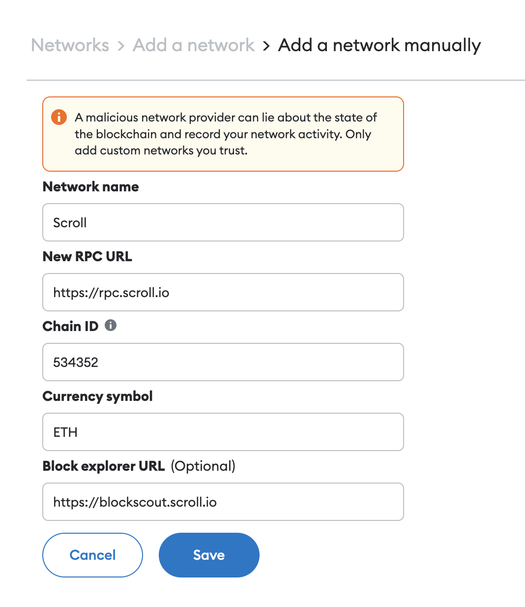
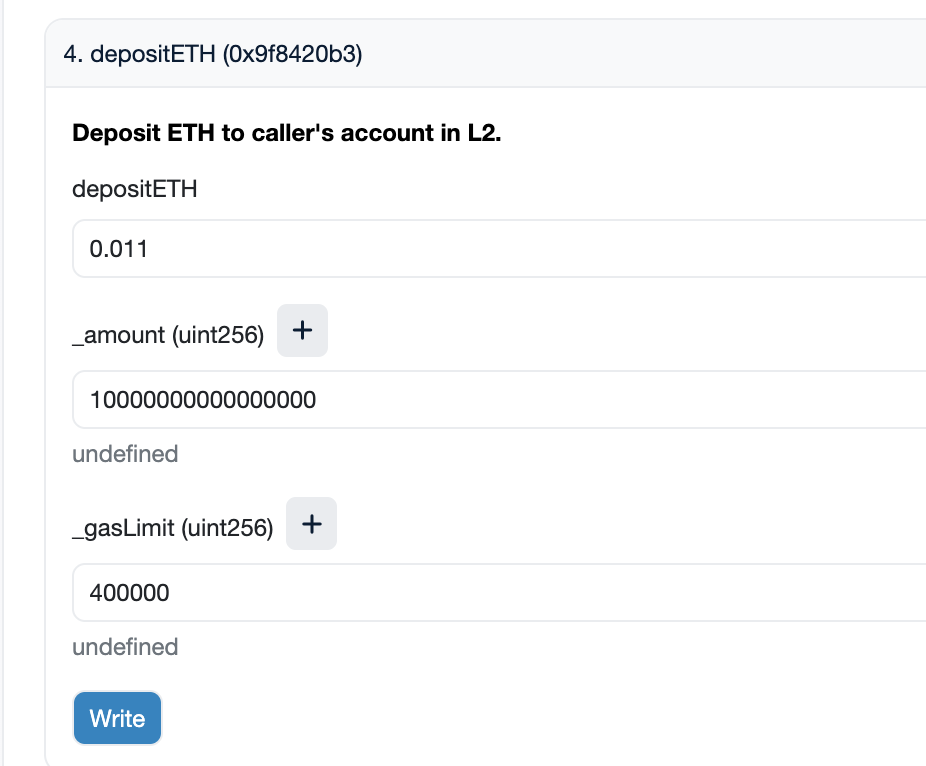

# WTF Scroll开发入门: 1. Hello Scroll

这个教程会教大家如何在Scroll上开发智能合约。

推特：[@0xAA_Science](https://twitter.com/0xAA_Science)

社区：[Discord](https://discord.gg/5akcruXrsk)｜[微信群](https://docs.google.com/forms/d/e/1FAIpQLSe4KGT8Sh6sJ7hedQRuIYirOoZK_85miz3dw7vA1-YjodgJ-A/viewform?usp=sf_link)｜[官网 wtf.academy](https://wtf.academy)

所有代码和教程开源在github: [github.com/WTFAcademy/WTF-Scroll](https://github.com/AmazingAng/WTFSolidity)

-----

Scroll是一个EVM等效的zkRollup以太坊扩容方案，目前主网刚上线。由于和EVM等效，以太坊的开发者可以很容易的迁移到Scroll上进行开发。这一讲，我们将介绍如何连接Scroll主网，并把ETH跨链到Scroll。

## 连接Scroll主网

目前，Scroll主网只有官方的RPC可以用。

```
Network Name: Scroll
RPC: https://rpc.scroll.io
Chain ID: 534352
Currency Symbol: ETH
Block explorer URL: https://blockscout.scroll.io
```

你可以按照下面的截图在Metamask中添加Scroll主网：



或点击链接：[ChainList - Scroll](https://chainlist.org/?search=scroll)

## 将ETH跨链到Scroll主网

目前Scroll主网的跨链桥已经搭好，但是网页前端还没有开放，你只能通过直接与合约交互的形式进行跨链，推荐使用Etherscan进行合约交互。

> 注意⚠️：直接与合约交互有一定风险，输入错误的参数可能会导致你的资产丢失。

跨链桥合约地址（以太坊主网）: [0xf8b1378579659d8f7ee5f3c929c2f3e332e41fd6](https://etherscan.io/address/0xf8b1378579659d8f7ee5f3c929c2f3e332e41fd6#writeProxyContract)。

需要与第4个函数`depositETH`交互，它有`3`个参数。

- 第一个参数是传入合约的ETH数量，以`ether`为单位，要跨链`0.01` ETH目前需要填`0.011`，好像有`0.001` ETH的手续费

- 第二个参数`_amount`是跨链的ETH数量，以`wei`为单位（`1 ether = 10^18 wei`），要跨链`0.01` ETH就填`10000000000000000`（1后面跟16个零）。

- 第三个参数`_gasLimit`，填`400000`。



之后点击确认交易，大概~15分钟后，你可以在Scroll主网收到你跨链的ETH！

## 总结

这一讲，我们简单的介绍了Scroll，如何将钱包连接到Scroll主网，并通过跨链桥将以太坊主网的ETH跨链到Scroll。
